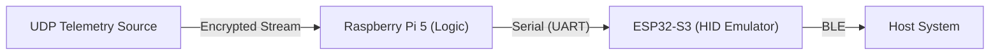

# ClubmanHard: UDP Telemetry Controller Interface

🇨🇳 **[中文说明 (Chinese Readme)](README.zh-CN.md)** | 📖 **[Deployment Guide](DEPLOY.md)**

> [!IMPORTANT]
> **DISCLAIMER: EDUCATIONAL USE ONLY**
>
> This software is a **Proof of Concept (PoC)** for embedded systems communication and hardware interface programming.
> It demonstrates how to process encrypted UDP telemetry streams and map them to physical hardware control signals.
> The author assumes **NO responsibility** for hardware damage, unintended behavior, or misuse in third-party applications.
> **Use at your own risk.**

## Project Overview
ClubmanHard is a technical research project exploring **Hardware Loopback Control**.
It functions by receiving generic UDP telemetry packets (decrypted via Salsa20), processing them through a PID control loop on a Raspberry Pi 5, and sending control commands via UART to an ESP32-S3 microcontroller. The ESP32 then emulates a standard Bluetooth LE Gamepad.

### Architecture

### Key Features
*   **Headless Operation**: Designed to run on Raspberry Pi 5 without a display.
*   **Hardware Emulation**: Uses ESP32 to emulate a standard Bluetooth Gamepad (HID), ensuring complete isolation from the host software.
*   **Real-Time Processing**: Decrypts and analyzes UDP telemetry packets in real-time.
*   **Heuristic Steering Control**: Implements a PID-based steering algorithm based on relative orientation vectors.
*   **Automated Input Sequences**: Supports "Blind" State Machine logic for automated testing of user interface navigation.

## Usage
Please refer to the **[Deployment Guide](DEPLOY.md)** for detailed hardware wiring, firmware installation, and operational instructions.

## License
This project is licensed under the **EUPL-1.2** (European Union Public License).
